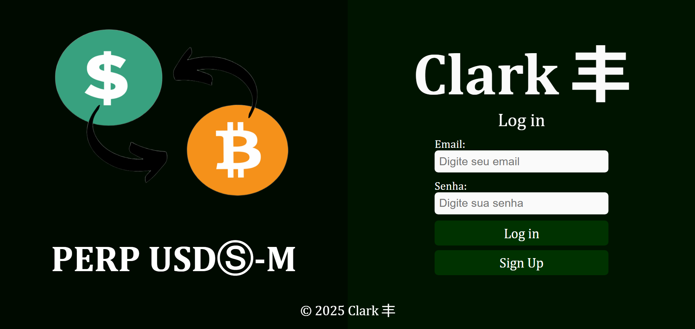
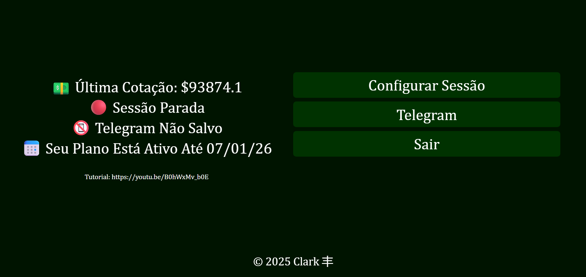
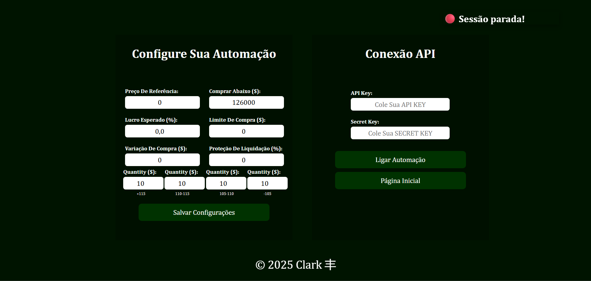

## ⚡ Clark – Automação de Futuros BTC/USDT
- Meu sistema mais completo e modular até o momento, feito para operar contratos futuros de BTC/USDT automaticamente, suportando usuários de forma assíncrona e paralela.
- Com comunicação em tempo real consumindo Websocket e APIs externas, o sistema gerencia tarefas de forma contínua, gerando e validando pagamentos, com uma interface web simples e intuitiva.

### 🚀 TECNOLOGIAS UTILIZADAS
- **Python + Django** – Backend estruturado nas camadas domínio, aplicação, infra e web;
- **HTML/CSS** - Interfaces e formulários simples;
- **PostgreSQL** – Modelado para persistência de pagamentos válidos;  
- **Redis** – Cacheando dados de uso frequente e broker para o Celery;
- **Celery** – Tarefas assíncronas contínuas e escaláveis;
- **WebSockets** – Em thread dedicada para atualização de preço em tempo real;
- **Locust** - Teste de carga simulando usuários concorrentes.
- **Nginx + Gunicorn** – Deploy seguro e performático;
- **Docker + GHCR** – Build e distribuição de imagens para EC2;
- **CI/CD** - Pipelines CI/CD com testes e deploy automático via GitHub Actions;
- **AWS EC2** – Servior de produção para execução contínua;

### 🧠 APRENDIZADOS
- Desenvolvi meu melhor algoritmo até o momento, abrindo compras sem repetir faixas de preço;
- Prints são pontuais para debug apenas;
- Arquitetura hexagonal, DDD e princípios SOLID, modelando aplicação, domínio, infra e web;
- Criação de pipelines completos de CI/CD;
- Gerenciamento de estado distribuído entre API, tarefas assíncronas e webSocket;
- Configuração de websocket com reconexão;
- Boas práticas de código limpo, organização modular e testes automatizados;
- Integração segura com APIs REST usando autenticação por assinatura HMAC-SHA256;
- Escalabilidade com Celery + Redis;
- Deploy contínuo em Docker, incluindo Gunicorn e Nginx;
- Testes unitários com mocking de integrações externas;
- Testes de carga analisando comportamento, identificando gargalos e falhas sob concorrência;

### 📌 FUNCIONALIDADES
- Cadastro e login de usuários;
- Validação de pagamentos e geração de invoices com QRCode;
- Configurações de automação por usuário;
- Trading automático para compras e vendas distribuídas em faixas de preço;
- Notificação automática utilizando API externa;

### 📚 CONCLUSÃO E CRÉDITOS
- Desenvolvido por **Leandro R. Martins**

### 📸 IMAGENS DA EXECUÇÃO

